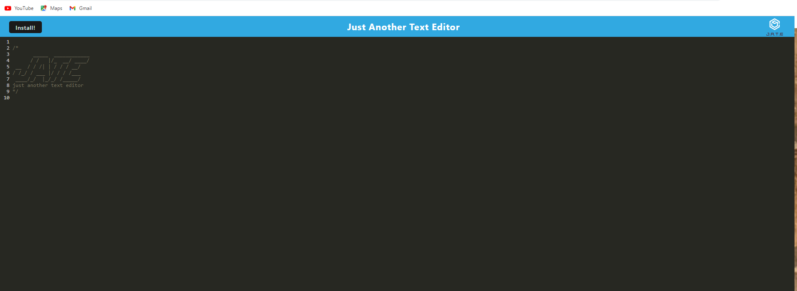

# text-editor-pwa

## Description  

 a text editor web application
 I open my application in my editor and I should see a client server folder structure.
 I run `npm run start` from the root directory I find that my application should start up the backend and serve the client. I run the text editor application from my terminal
and I find that my JavaScript files have been bundled using webpack. I run my webpack plugins
then I find that I have a generated HTML file, service worker, and a manifest file. I use next-gen JavaScript in my application to find that the text editor still functions in the browser without errors. I open the text editor and find that IndexedDB has immediately created a database storage.
 I enter content and subsequently click off of the DOM window and find that the content in the text editor has been saved with IndexedDB. I reopen the text editor after closing it
and find that the content in the text editor has been retrieved from our IndexedDB. I click on the Install button and download my web application as an icon on my desktop.
Then I load my web application and  have a registered service worker using workbox.

## Installation   

## URL

https://another-editor.herokuapp.com/

## Github URL

https://github.com/Jacobschoenbauer/text-editor-pwa

## Picture  

